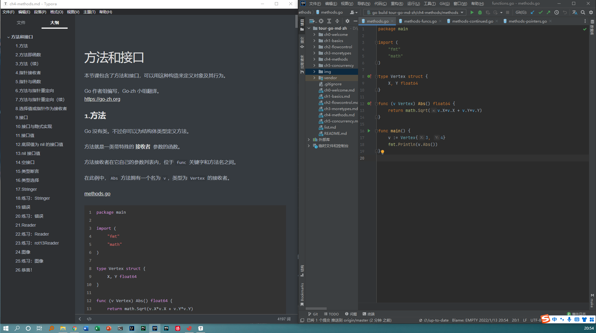

# tour-go-md

本项目提供了[中文版 tour-go](https://tour.go-zh.org/ ) (2022/01/12版本) 的 **markdown 文档**与**相应的 .go 文件**
，所有内容由[中文版 tour-go](https://tour.go-zh.org/ ) 整理而来，其中

- 所有 go 代码均有链接跳转，可在本地调试、运行、修改，建议初学者清空代码后自己再敲一遍加深理解；
- 所有网址均可跳转（如果有网址失效请在 `issues`中提交）；
- 网页中使用的 `script 动作`无法响应。
  